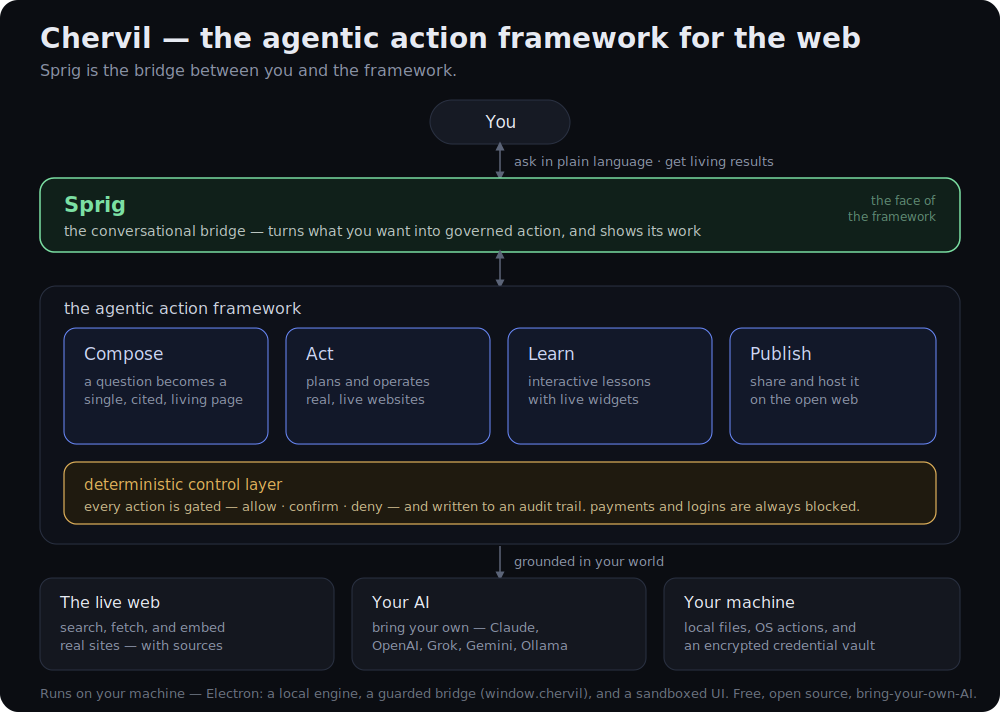

# Chervil — the agentic action framework for the web

*A short paper on what Chervil is, how it works, and why it's built the way it is.*

> **Thesis.** The web has spent thirty years optimizing for *browsing* — a human reading documents one tab at a time. Chervil is built for what comes after: *agentic action*, where you say what you want and a system gathers, composes, operates, teaches, and publishes on your behalf. Chervil is that framework. **Sprig is the bridge between you and it.**

## 1. From browsing to action

A browser is a window onto documents. You do the work: search, open ten tabs, read, cross-check, copy things into a doc, come back tomorrow to see what changed. The interface assumes *you* are the agent.

The shift underway is bigger than "AI search." It's the move from answer engines — which hand you a fact — to **agentic systems** that do the work: assemble the page, run the steps, keep it current. Chervil treats that as a *framework*, not a feature: a small set of action primitives, a single conversational entry point, and a hard boundary around anything that touches the real world.

The destination comes to you, purpose-built, every time. Not ten blue links.

## 2. Sprig — the bridge

Every framework needs an interface. Chervil's is **Sprig** — a conversational guide you actually talk to. Sprig is not a chatbot bolted onto a browser; it is the *bridge* in the architectural sense:

- **It translates intent into action.** You ask in plain language ("teach me Sentinel," "fill this form," "keep this page current"). Sprig decides which framework primitive applies — compose a page, operate the site, build a lesson, publish — and drives it.
- **It carries results back.** What the framework produces — a cited page, a running task, an interactive lesson — comes back *through* Sprig, in context, with its work shown.
- **It is the only thing you address.** There is one surface to learn, not a toolbar of modes. The omnibox is the same bar whether you're opening a real site, asking a question, or running a command.

Crucially, Sprig is a bridge, **not an authority**. It decides *what* to attempt; it does not get to decide, on its own reasoning, what is *allowed*. That distinction is the whole safety model (§4).

## 3. The framework — four action primitives

Underneath Sprig, the framework is deliberately small. Four primitives cover the surface area:

- **Compose.** A question becomes a single, self-contained, image-rich page — grounded in live web search, with its sources shown and one-click verification of its own claims. Pages can be told to stay *live* and re-ground themselves on a schedule.
- **Act.** Sprig operates real websites on your behalf: it drafts a short plan, then works through it step by step — searching, clicking, filling, navigating — adapting as the page reveals reality. (Governed by §4.)
- **Learn.** Sprig builds interactive lessons and graded quizzes. The "applet" card composes a real, self-contained interactive **widget** — dropdowns, simulators, live-computed output — that works in the app *and* on the published page.
- **Publish.** Any of the above — a page, a lesson, a quiz, a whole workspace — goes live to a shareable link that opens on any phone, with a public profile and optional cloud hosting that keeps it current for everyone.

These compose with each other: a lesson is composed, can be acted upon, and is published; a page can be learned from and kept living. One framework, four verbs.

## 4. The deterministic control layer

An agentic browser holds your keys and can act on your behalf — so "trust the model" is not good enough. Authority in Chervil does **not** live in the model's reasoning. A deterministic layer governs every action the framework is allowed to take:

- Every state-changing action is classified and **gated** — *allow*, *confirm*, or *deny* — by rules, not by the model's judgment.
- Sensitive categories are **always blocked**: entering passwords, completing payments, moving money. Sprig hands those back to you.
- Every action is written to an **audit trail** you can read.
- You grant permission **per action**, and approval in one place never silently generalizes to the next.

This is the load-bearing design decision: the model proposes, a deterministic policy disposes, and you stay in the loop for anything irreversible or outward-facing.

## 5. Grounded in your world

The framework is only as good as what it can reach. Chervil grounds in three things you already own:

- **The live web.** Real search and fetch (with citations), and the ability to embed and operate actual websites — not a model's stale memory of them.
- **Your AI.** Bring your own provider — Claude, OpenAI, Grok, Gemini, or local Ollama. Your keys, encrypted on your machine; the model is pluggable, the framework is not.
- **Your machine.** Local (and cloud-synced) files as context, read-only system facts, OS actions behind the control layer, and an encrypted, passphrase-locked credential vault that Sprig itself never sees.

## 6. How it runs

Chervil is a desktop application, and that is a feature, not a limitation. The capabilities that make it more than a browser — embedding live sites, reaching local files, holding keys locally, touching the OS — are precisely the ones a browser tab is forbidden to do.

Three parts, cleanly separated:

- **A local engine.** The compose-and-act pipeline (`lib/agent.js`, the provider adapters in `lib/models/*`) runs in the app's main process, calling your chosen AI directly with your local keys.
- **A guarded bridge.** A narrow, allow-listed surface — `window.chervil` — is the *only* channel between the sandboxed UI and the engine. Composed pages and applets reach the framework through it; nothing else gets through.
- **A sandboxed UI.** Everything you see renders in a locked-down view. Model-generated content (pages, interactive widgets) runs under a hardened content-security policy — interactive, but contained.

The same engine is what lets a published lesson's widgets work on the open web: they're **baked into the page** as self-contained, sandboxed mini-apps at publish time, so they stay interactive for everyone, with no live connection required.

## 7. Open, and built to be trusted

Because an agentic system holds your keys and acts for you, "trust me" isn't a model — it's a liability. Chervil is **open source**: read the code, run it, contribute. It is **bring-your-own-AI**: no model lock-in, no key custody by us. And it is **local-first**: your data, your machine, your control. The deterministic layer that governs every action is right there in the open, not a promise.

---

**In one line:** Chervil is the agentic action framework for the web — *compose, act, learn, publish* — and Sprig is the conversational bridge that turns what you want into governed action, grounded in the live web, your own AI, and your own machine.

*Free and open source · bring your own AI · runs on your machine · [getchervil.com](https://getchervil.com) · [github.com/chervil-ai/chervil](https://github.com/chervil-ai/chervil)*
